# 👋 Hi, I'm Kousei
<!-- 个性化签名，比如「全栈开发者 | 热爱前端/后端」 -->
💻 Back-end Developer | 🚀 Golang enthusiasts | 🎮 Game enthusiast

## 📌 关于我
- 🔭 目前专注于：Golang后端开发
- 🌱 学习中：数据库，Redis
- 📫 联系我：zzy060103@gmail.com

## 📊 我的 GitHub 数据

  
  

## 🐍 Contribution Snake

  <picture>
    <source media="(prefers-color-scheme: dark)" srcset="https://raw.githubusercontent.com/awu123-create/awu123-create/output/snake.svg">
    <source media="(prefers-color-scheme: light)" srcset="https://raw.githubusercontent.com/awu123-create/awu123-create/output/snake-light.svg">
    
  </picture>

